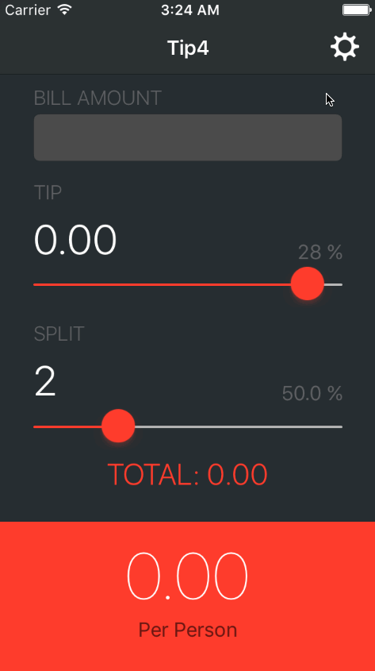

# Tip4 - Tip Calculator

This is a Tip4 application for iOS submitted as the [pre-assignment](http://courses.coderschool.vn/swift/prework) requirement for Codeschool.vn.

Time spent:  5 hours

Completed:

* [x] Required: User can enter a bill amount, choose a tip percentage, total split and see the tip, total pay and to total tip for single person.
* [x] Required: Settings page to change the default tip percentage and split.
* [x] Optional: UI animations
* [x] Additional: Theming the Settings page like the main application page.
* [x] Additional: Also remembering the tip percentage, split across app restarts.

Notes:

This only works for all restina iPhone in Portrait orientation. I did not spend any time making the app look right in iPad screen sizes and Landscape orientation.

GIF created with [LiceCap](http://www.cockos.com/licecap/).
